<div id="top"></div>

# Developer Guide

## Acknowledgements

{list here sources of all reused/adapted ideas, code, documentation, and third-party libraries -- include links to the 
original source as well}

## Table of Contents

- [Design](#design)
  - [Architecture](#design-architecture)
  - [Ui](#design-ui)
  - [Parser](#design-parser)
  - [Storage](#design-storage)
  - [Help](#design-help)
  - [Add](#design-add)
  - [List](#design-list)
  - [Filter](#design-filter)
  - [TopoSort](#design-toposort)
  - [Export](#design-export)
- [Implementation](#implementation)
  - [Ui](#implementation-ui)
  - [Parser](#implementation-parser)
  - [Initializing previous saved data feature](#implementation-initialize)
  - [Writing a CS2040CFile to data file](#implementation-write)
  - [Help Feature](#implementation-help)
  - [Add CS2040CFile feature](#implementation-add)
  - [List feature](#implementation-list)
  - [Filter by keyword feature](#implementation-filter)
  - [TopoSort feature](#implementation-toposort)
  - [Export feature](#implementation-export)
- [Product scope](#product-scope)
- [User Stories](#user-stories)
- [Use Cases](#use-cases)
- [Non-Functional Requirements](#non-functional-requirements)
- [Glossary](#glossary)
- [Instructions for manual testing](#instructions)
  - [Initialisation](#instructions-initialisation)
  - [Shutdown](#instructions-shutdown)
  - [Adding a `Note`](#instructions-add)
  - [Listing all `Files`](#instructions-list)
  - [Deleting a `File`](#instructions-delete)
  - [Filtering `Files`](#instructions-filter)
  - [Exporting `Files`](#instructions-export)
  - [Saving data](#instructions-save)

<div id="design"></div>

## Design

<div id="design-architecture"></div>

### Architecture

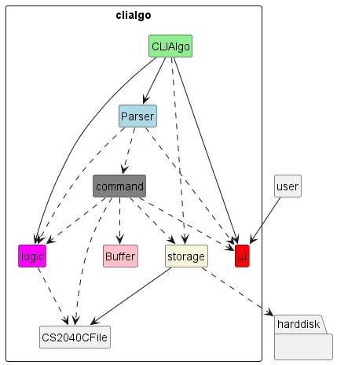

The **_Architecture Diagram_** given above explains the high-level design of `CLIAlgo`.

Given below is a quick overview of the main components and how they interact with each other.

#### Main components of the architecture

- `CLIAlgo`: consist of only 1 main method, and it is responsible for initializing the components
in the correct sequence and connects them with each other during runtime.
- `Ui`: Responsible for handling all interactions with the user.
- `Parser`: Responsible for making sense of all commands entered by the user.
- `Topic`: A class responsible for managing all files allocated to single topic in CS2040C.
- `TopicManager`: A class responsible for handling operations involving all `Topic`.
- `command`: A collection of `Command` objects which handles the different functionalities of `CLIAlgo`.
- `file`: A collection of files used in CS2040C.
- `storage`: A collection of classes responsible for reading, storing and writing data to the hard disk.

#### How the architecture components interact with each other

The **_Sequence Diagram_** below shows a high level overview of how the components interact with each other

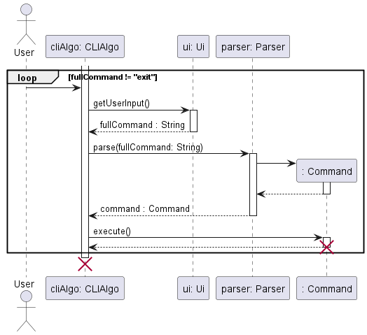

> **! Note**: The lifeline for `CLIAlgo`, `Ui`, `Parser` and `Command` should end at the destroy marker (X) but due to 
> limitation of PlantUML, the lifeline reaches the end of the diagram.

<p align="right">(<a href="#top">back to top</a>)</p>
<div id="design-ui"></div>

### Ui
[**API**](../src/main/java/seedu/clialgo/Ui.java) : `Ui.java`

Here is a class diagram of the `Ui` component which is responsible for handling all interaction with the User.

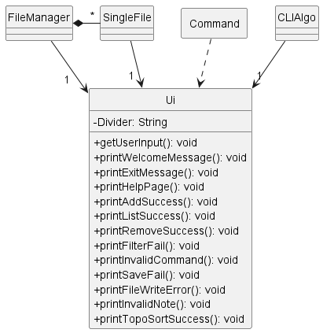
   
The `Ui` component:
- Reads in the full command keyed in by the user for the `Parser`.
- Prints error messages when the user provides invalid inputs.
- Prints confirmation message when a command have been executed successfully.

<p align="right">(<a href="#top">back to top</a>)</p>
<div id="design-parser"></div>

### Parser
[**API**](../src/main/java/seedu/clialgo/Parser.java) : `Parser.java`
Here is a class diagram of the `Parser` component which is responsible for processing commands
and preparing the appropriate `Command` object.

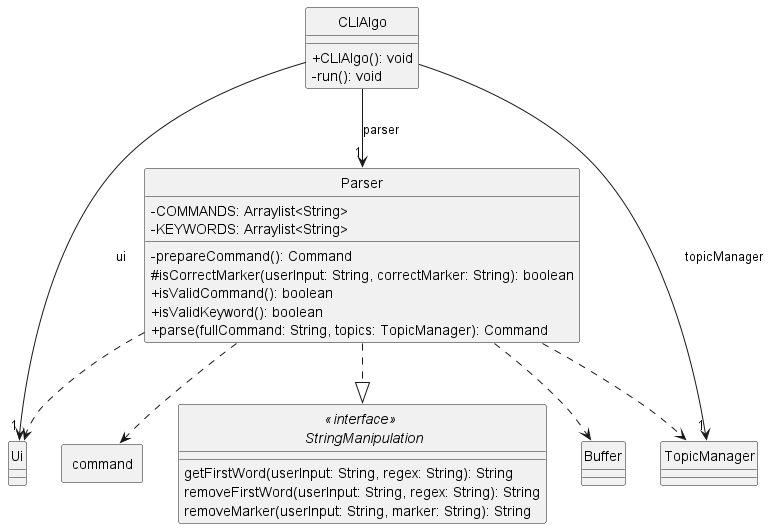

The `Parser` component:
- Reads in the full command keyed in by the user through the `Ui` class.
- Extracts out the keywords from the command such as `command type`, `topic`, `file name` using
the `StringManipulation` interface.
- Verify the validity of the user's input command.
- Handle cases where the user keys in an invalid command.
- Returns the appropriate `Command` object that will be executed by `CLIAlgo`.

<p align="right">(<a href="#top">back to top</a>)</p>
<div id="design-storage"></div>

### Storage
[**API**](../src/main/java/seedu/clialgo/storage/FileManager.java) : `FileManager.java`

Here is a class diagram of the `FileManager` which facilitates the storage
function of the application.

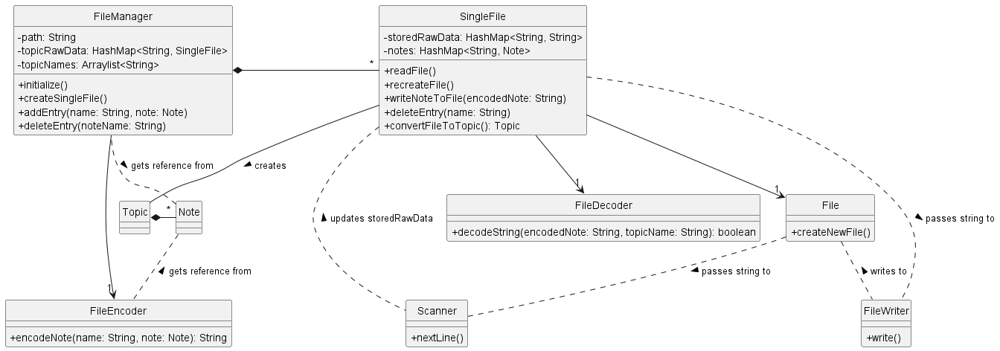

The `FileManager` component
- can save each `Topic`'s data as an individual `.txt` file
- can interpret `Note` and `Code` objects as a `String` and store it into its 
corresponding `Topic`'s  `.txt`
- updates the corresponding `Topic`'s  `.txt` whenever a `add` or
`remove` command is called by the user
- reads from each `Topic`'s  `.txt` and returns a `Topic` object when
initializing the application

<p align="right">(<a href="#top">back to top</a>)</p>
<div id="design-help"></div>

### Help
[**API**](../src/main/java/seedu/clialgo/command/HelpCommand.java) : `HelpCommand.java`

Here is a class diagram of the `HelpCommand` which is responsible for teaching the user how to use the commands.


The `HelpCommand` component
- Provides the user with a list of valid commands in `CLIAlgo`.
- Provides the user with the correct format for each command in `CLIAlgo`.

<p align="right">(<a href="#top">back to top</a>)</p>
<div id="design-add"></div>

### Add
[**API**](../src/main/java/seedu/clialgo/command/AddCommand.java) : `AddCommand.java`

Here is a class diagram of the `AddCommand` which is responsible for adding either code files or note files

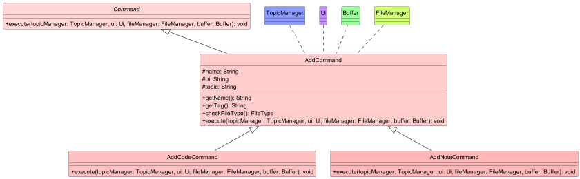

The `AddCommand` component
- can check if the CS2040CFile to be added into our CLIAlgo exists within the same directory as the program
- can check for the type of CS2040CFile, whether it is `.txt` or `.cpp` based on the name of the CS2040CFile
- can ensure that there are no files with repeated names such that all names of files added are unique

<p align="right">(<a href="#top">back to top</a>)</p>
<div id="design-list"></div>

### List
[**API**](../src/main/java/seedu/clialgo/command/ListCommand.java) : `ListCommand.java`

Here is the class diagram of the `ListCommand` which is responsible for listing all `CS2040CFile` in `CLIAlgo`.

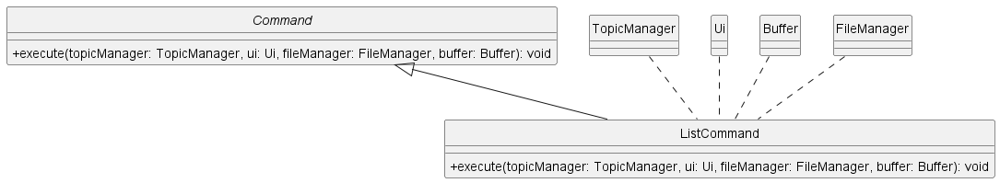

The `ListCommand` component
- Prints out all `CS2040CFile` stored in `CLIAlgo` in **any** order.
- Indicates if the `CS2040CFile` is a `Note` or `Code`.
  - If the `CS2040CFile` is a `Note`, it would be labelled with `[NOTE]` before the name of the `CS2040CFile`.
  - If the `CS2040CFile` is a `Code`, it would be labelled with `[CODE]` before the name of the `CS2040CFile`.

<p align="right">(<a href="#top">back to top</a>)</p>
<div id="design-filter"></div>

### Filter
[**API**](../src/main/java/seedu/clialgo/command/FilterCommand.java) : `FilterCommand.java`

Here is the class diagram of the `FilterCommand` which is responsible for sorting the `CS2040CFiles` according to
the user's specified `keyWord`.

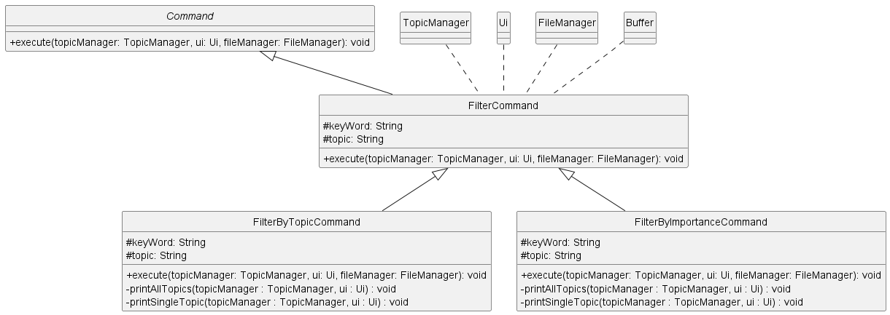

The `FilterCommand` component
- instantiate a subclass based on the `keyWord` used in its constructor.
   - If the `keyWord` is `topic` it creates and instance of its subclass `FilterByTopicCommand` and invoke the
     `execute()` method.
   - If the `keyWord` is `importance` it creates and instance of its subclass `FilterByImportanceCommand` and invoke the
     `execute()` method.
- The respective subclasses will print the `CS2040CFiles` filtered based on the `keyWord` provided.

<p align="right">(<a href="#top">back to top</a>)</p>
<div id="design-toposort"></div>

### TopoSort
[**API**](../src/main/java/seedu/clialgo/command/TopoCommand.java) : `TopoCommand.java`

Here is a class diagram of the `TopoCommand` which facilitates the storage
function of the application.

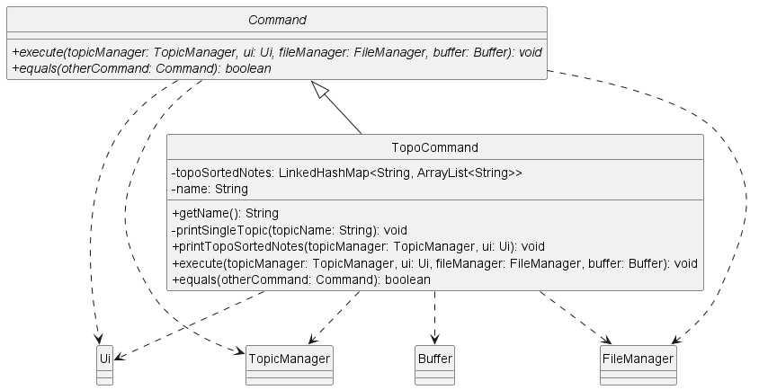

The `TopoCommand` component
- can topologically sort `CS2040CFile` objects in a specific `topic` order
- can print out the list of topologically sorted `CS2040CFile` objects
- can check whether there are `CS2040CFile` objects within `CLIAlgo` and inform user if no such objects are saved

<p align="right">(<a href="#top">back to top</a>)</p>
<div id="design-export"></div>

### Export
[**API**](../src/main/java/seedu/clialgo/Buffer.java) : `Buffer.java`

Here is a class diagram of the `Buffer` which facilitates the storing of `CS2040CFiles`
returned from `filter` and `topo` commands and the copying of `CS2040CFiles` stored within
into `.\\export` and opening the folder subsequently if supported by the Operating System.

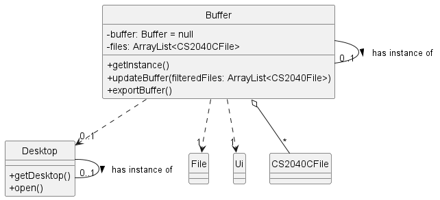

The `Buffer` component
- can store `CS2040CFiles` when `FilterCommand` and its derivatives or `TopoCommand` is executed
- can update stored `CS2040CFiles`
- can copy `CS2040CFiles` into `.\\export` folder
- can delete `CS2040CFiles` in `.\\export` folder
- can open `.\\export` folder automatically if supported by the Operating System

<p align="right">(<a href="#top">back to top</a>)</p>
<div id="implementation"></div>

## Implementation

<div id="implementation-ui"></div>

### Ui
#### Current implementation

All UI interactions are taken care of by the Ui class. It is responsible for taking in user inputs and giving text-ui
outputs to provide guidance and a pleasant user experience overall. The Ui uses the `Scanner` class from `java.util` to
take in input from the user and `System.out.println()` method from `java.lang` to output messages to the user.

Given below is an example of how the `Ui` works when it is issued a list command.

> **Step 1**: The user enters a command. The full command is read in by the `Ui` using the `getUserInput()` method. The
> `Ui` uses the `nextLine()` method of the `Scanner` object to read in the user input.

> **Step 2**: If it encounters a `NoSuchElementException` or `IllegalStateException`, it returns an `EXIT_COMMAND` which
> safely closes the application. If no exception has occurred, the `Ui` returns the `String` to `CLIAlgo`.

> **Step 3**: When the `ListCommand` is executed, it calls the `printListOfCS2040CFiles()` method of the `Ui`. The `Ui`
> then iterates through the `ArrayList` provided by the `ListCommand` and prints the `CS2040CFile` label and name on a 
> new line using the `println()` method from `System.out`.

The following **_Sequence Diagram_** shows how the Ui object is used.

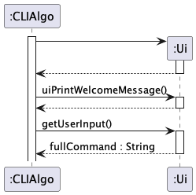

> **! Note**: The lifeline for `ListCommand` should end at the destroy marker (X) but due to limitation of PlantUML,
> the lifeline reaches the end of the diagram.

<p align="right">(<a href="#top">back to top</a>)</p>
<div id="implementation-parser"></div>

### Parser
#### Current Implementation

Parsing of commands is done by the `Parser` class. It implements the `StringManipulation` interface which allows
`Parser` to extract the relevant keywords to prepare the appropriate `Command` object. It is also responsible for
handling invalid inputs by the user. The `Parser` consist of the following methods.

- `parse()`: Extracts out the command keyword from the user input.
- `prepareCommand()`: Prepares the appropriate `Command` object based on the command keyword and the other
relevant input fields provided by the user. It also checks if the format of the command is correct.
- `isCorrectMarker()`: Checks if the marker used to label the input fields are correct.
- `isValidImportance()`: Checks if the importance value provided by the user is a valid integer and within the [1, 10]
range.
- `isValidKeyword()`: Checks if the `keyWord` provided by the user is valid when preparing the `FilterCommand`.
- `isValidCommand()`: Checks if the command keyword provided by the user is valid.

Given below is an example of how the `Parser` works when it is issued a remove command.

> **Step 1**: The user enters a command. The full command is read in by the `Ui`. `CLIAlgo` invokes the `parse()`
> method from the `Parser`.

> **Step 2**: The `parse()` method extracts out the command keyword provided by the user. It then calls the 
> `prepareCommand()` method.

> **Step 3**: The `prepareCommand()` identifies the correct `Command` object to prepare based on the command keyword.
> Since the command keyword provided is `remove`, `prepareCommand()` calls `prepareRemoveCommand()`.

> **Step 4**: If the `NAME` field of the command is null or not labelled using the correct marker, 
> `prepareRemoveCommand()` returns an `InvalidCommand` object. If the `NAME` input field is valid, a `RemoveCommand` 
> object is returned.

The following **_Sequence Diagram_** shows how the Parser work.

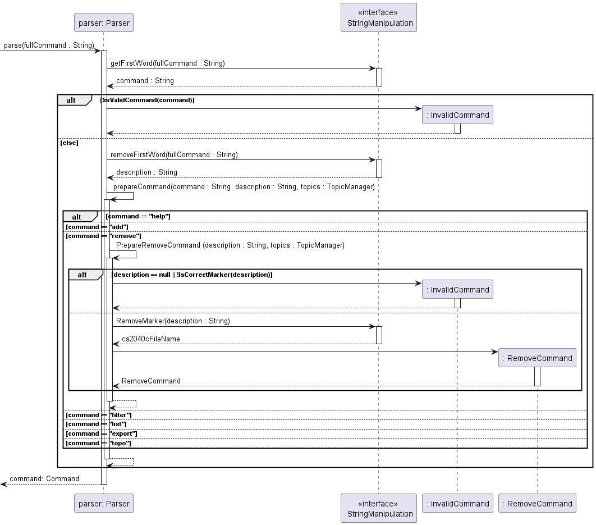

<p align="right">(<a href="#top">back to top</a>)</p>
<div id="implementation-initialize"></div>

### Initializing previous saved data feature
#### Current implementation

The function for reading the previously saved data is facilitated by the `FileManager`. The `FileManager`
creates a `SingleFile` for each valid topic name and invokes `createNewFile` for those files in the for
in `TOPIC_NAME.txt` in the folder `.\\data`. If the files already exist, they are not created. Instead,
the contents of the file would be read line-by-line. The read data would then be passed to `FileDecoder`
which would then convert these raw data into `CS2040CFile` objects. The `CS2040File` objects are then passed
into a `HashMap` which represents the topic these `CS2040CFile` objects belong to. The `HashMap` is then passed
back to the `TopicManager`, completing the initialization process.

Given below is how the sequence of `initialize()` is run

> **Step 1**: During the start-up of the application, a folder is created to store all the data files.

> **Step 2**: For every `Topic`, create a `SingleFile` which containing the data file of those `Topics`
> with the path `.\\data\\TOPIC_NAME.txt` where TOPIC_NAME is replaced with the name of the `Topic`.
> This only occurs if the file did not exist prior to the running of the application.

> **Step 3**: If the file already existed prior, readFile() is run. This creates a `Scanner` which would 
> translate the data file line by line into `String`. Each line of `String` corresponds to a `CS2040CFile`.

> **Step 4**: The `String` is then decoded using `decode()` and is converted into a `CS2040CFile`. If the
> `String` is unable to be converted into a `CS2040CFile`, the `String` is deemed to be corrupted and is 
> subsequently deleted from the data file.

> **Step 5**: The translated `CS2040CFiles` are then stored within the `SingleFile`. `FileManager` then
> invokes `decodeAll()` which retrieves all the `Topics` stored within each `SingleFile` which contains
> all the `CS2040CFiles`. This is returned in the form of a `HashMap`.

The following **_Sequence Diagram_** shows how previously saved files are loaded into `CLIAlgo`.

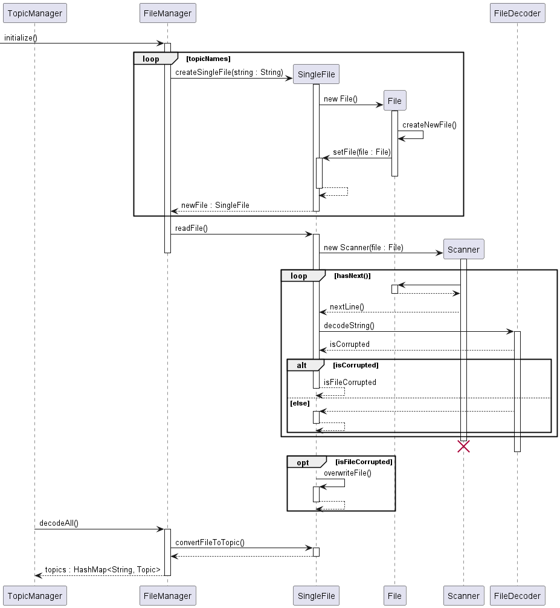

> **! Note**: The lifeline for `Scanner` should end at the destroy marker (X) but due to limitation of PlantUML,
> the lifeline reaches the end of the diagram.

<p align="right">(<a href="#top">back to top</a>)</p>
<div id="implementation-write"></div>

### Writing a `CS2040CFile` to data file
#### Current Implementation

The function for writing a `CS2040CFile` to a data file is facilitated by the `FileManager`. When the `addEntry`
is called, an already created `CS2040CFile` and its name is passed to the `FileManager`. The `FileManager` then 
passes the `CS2040CFile` to the `FileEncoder` which translates it into raw data. The raw data is then written into
the data file using the `BufferedWriter`.

Given below is how a single `CS2040CFile` is entered into the data file:

> **Step 1**: When a valid `CS2040CFile` is added to the application, it is passed to the `FileManager` and 
> addEntry() is invoked.

> **Step 2**: The `CS2040CFile` is then passed to the `FileEncoder` and a `String` representing the 
> `CS2040CFile` is returned to the `FileManger`.

> **Step 3**: A `FileWriter` object is then created and a `BufferedWriter` object is also created containing
> the `FileWriter`.

> **Step 4**: The previously encoded `String` is then passed to the `BufferedWriter` and `write()` and 
> `newLine()` is called. This writes the encoded `String` to the relevant data file and adds a new line
> to the data file.

> **Step 4**: `close()` is called for both the `BufferedWriter` and `FileWriter` to stop them from writing
> to the data file further.

The following **_Sequence Diagram_** shows how a `CS2040CFile` is encoded before being written to 
the relevant data file.

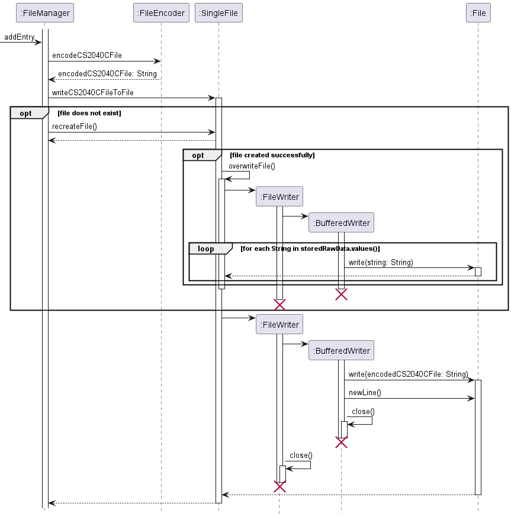

> **! Note**: The lifeline for `FileWriter` and `BufferedWriter` should end at the destroy marker (X) but due to 
> limitation of PlantUML, the lifeline reaches the end of the diagram.

<p align="right">(<a href="#top">back to top</a>)</p>
<div id="implementation-help"></div>

### Help Feature
#### Current Implementation

The help mechanism is facilitated by "HelpCommand". It extends the abstract `Command` with an overridden `execute()`
method. Within the `execute()` function, the input command after the `c/` delimiter is parsed and checked against the
valid commands supported by `CLIAlgo`. The command to which it matches is invoked from the Ui class.

Given below is an example usage of how the `help c/add` mechanism behaves at each step.

> **Step 1**: The user enters the `help` command, which is processed by the `Parser` which instantiates a `HelpCommand`
> using the appropriate constructor and returns it to `CLIAlgo`. 

> **Step 2**: The `execute()` method of `HelpCommand` is called by `CLIAlgo`.

> **Step 3**: Since the command provided is `add`, the `HelpCommand` calls the `printHelpAdd()` method from the `Ui`.
> This method prints out instructions on how the `add` command should be used in `CLIAlgo`.

> **Step 4**: HelpCommand object is destroyed and control is handed back to the `CLIAlgo`.

The following **_Sequence Diagram_** shows how the help operation work.

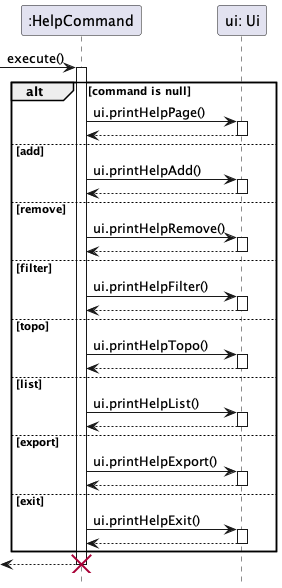

> **! Note**: The lifeline for `HelpCommand` should end at the destroy marker (X) but due to limitation of PlantUML,
> the lifeline reaches the end of the diagram.

<p align="right">(<a href="#top">back to top</a>)</p>
<div id="implementation-add"></div>

### Add CS2040CFile feature
#### Current Implementation

The add mechanism is facilitated by "AddCommand". It extends the abstract `Command` with an overridden `execute()`
method. Within the `execute()` function, the path of the CS2040CFile, as specified by its name, is checked using
`checkFileType`, to determine if the CS2040CFile exists within the directory of the program. The topic of the
CS2040CFile to be added is also checked using `isValidTopic` to ensure it is a valid topic in CS2040C,
and also the name of the CS2040CFile is checked using `isRepeatedCS2040CFile`, to ensure that no other files
of the same name exists. Following which, 1 of 2 different other executions is called, depending on the type of the
CS2040CFile.

Given below is an example usage of how the add feature behaves at each step.

> **Step 1**: The user launches the application for the first time. Objects `CLIAlgo`, `Ui`, `Parser` , `TopicManager`,
> `FileManager` are created.

> **Step 2**: The user enters the add command, which invokes the `getUserInput()` method of `Ui` object and returns the
> user input to the `CLIAlgo` object. After which, it invokes the `parse()` method of the `Parser` object and determines
> that it is an add command and creates a new `AddCommand` object.

> **Step 3**: The `CLIAlgo` object than invokes the `execute()` method of the `AddCommand` object.

> **Step 4**: The name of CS2040CFile is checked, to see if a file of that name exists within the directory. If it is
> not, the `printFileDoesNotExist()` method of the `Ui` object is invoked

> **Step 5**: The topic name of the CS2040CFile is checked, to see if it belongs to one of the topics in CS2040C. If it
> is, a new `InvalidTopicCommand` object is created and executed.

> **Step 6**: The name of CS2040CFile is checked, to see if a file of that name already exists inside  the
> `Topic Manager` object, which means that there are duplicates.

> **Step 7**: The `checkFileType` method is then used to check the type of the file to be added. If the file to be added
> is a `.txt` file, a new `AddNoteCommand` object would be created and its `execute()` method invoked. Otherwise, if the
> file to be added is a `.cpp` file, a new `AddCodeCommand` object would then be created its `execute()` method invoked.

> **Step 8**: The respective `execute()` methods of either the `AddCodeCommand` object or the `AddNoteCommand` object,
> will then handle adding of the file into the `File Mnanager` object by calling the `addEntry()` method and adding the
>  file into the `Topic Manager` object using the  `addCS2040CFile` method.

The **_Sequence Diagram_** below shows the `AddCommand` works.

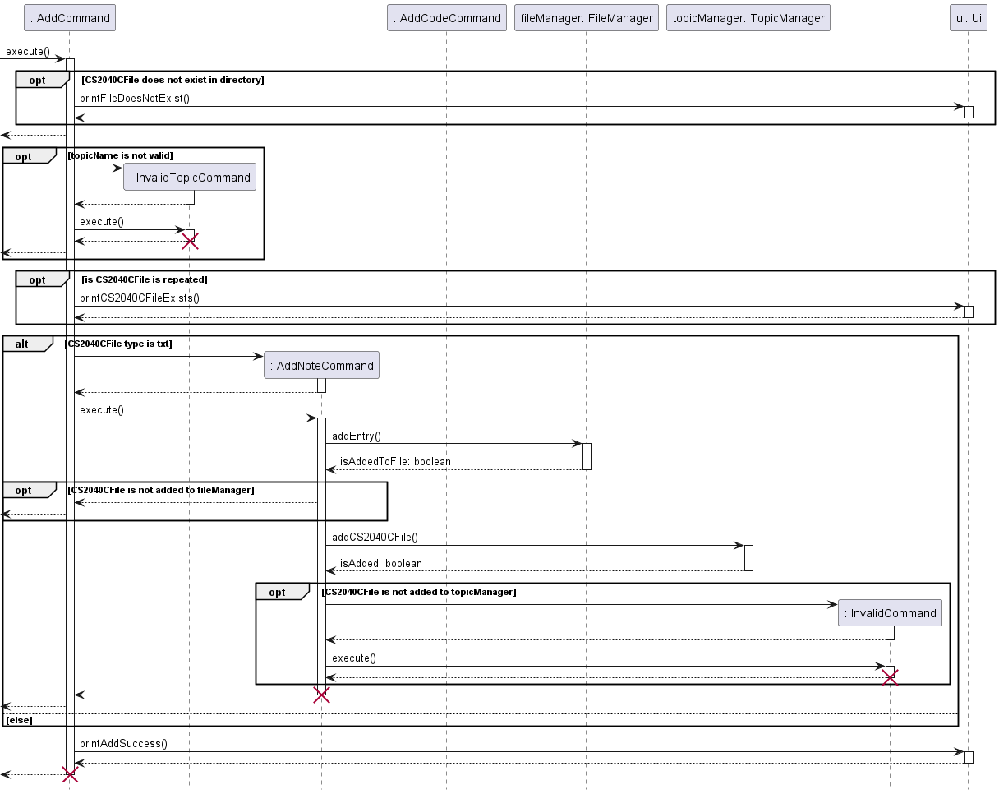

> **! Note**: The lifeline for `AddCommand`, `InvalidTopicCommand`, `AddNoteCommand` and `InvalidCommand` should end at 
> the destroy marker (X) but due to limitation of PlantUML, the lifeline reaches the end of the diagram.

<p align="right">(<a href="#top">back to top</a>)</p>
<div id="implementation-list"></div>

### List feature
#### Current implementation

The list feature mechanism is facilitated by `ListCommand`. It extends `Command` with an
overridden `execute()` method. It calls the `getAllCS2040CFiles()` method from the `TopicManager` to get all the
`CS2040CFile` stored in `CLIAlgo`. It then prints them out to the user.

Given below is an example usage scenario and how the list feature behaves at each step.

> **Step 1:** The user will input a command in the format `list`. The input will be read by the `Ui` and processed by the
> `Parser`. The `Parser` will then call the `prepareListCommand` to create a new `ListCommand` object.

> **Step 2:** The `execute` method of the `ListCommand` object will be executed. `ListCommand` first checks if the
> `TopicManager` is empty by calling the `isEmpty()` method of the `TopicManager`. If the `TopicManager` is empty, 
> `ListCommand` will print out a message to inform the user that the `TopicManager` is empty.

> **Step 3:** If the `TopicManager` is not empty, `ListCommand` calls the `getAllCS2040CFiles()` method from the 
> `TopicManager` which returns an `ArrayList<String>` containing the names and labels of all `CS2040CFile` stored in 
> `CLIAlgo`.

> **Step 4:** `ListCommand` iterates through the `ArrayList<String>` and prints the names of all the `CS2040CFile` 
> stored in `CLIAlgo`.

The following **_Sequence Diagram_** shows how the list operation work.

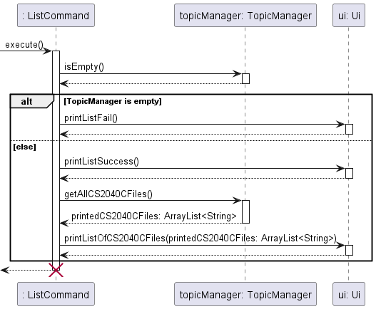

> **! Note**: The lifeline for `ListCommand` should end at the destroy marker (X) but due to limitation of PlantUML,
> the lifeline reaches the end of the diagram.

<p align="right">(<a href="#top">back to top</a>)</p>
<div id="implementation-filter"></div>

### Filter by keyword feature
#### Current Implementation

The filter mechanism is facilitated by `FilterCommand`. It extends `Command` with an overridden `execute()` method. The
`FilterCommand` has 2 subclass `FilterByTopicCommand` and `FilterByImportanceCommand`. Each with their own overridden 
`execute()` method. During execution, the `FilterCommand` decides which of its subclass to instantiate and execute 
depending on the `keyWord` provided. Both `FilterByTopicCommand` and `FilterByImportanceCommad`
`FilterCommand` object calls either the `getNotesByTopic()` or the `getAllNotesByTopic()` methods in the `TopicManager`.

- `FilterByTopicCommand`
  - `printAllTopics()` - Prints out all `CS2040CFiles` stored in CLIAlgo that is sorted by `topic`.
  - `printSingleTopic()` - Prints out all `CS2040CFiles` stored in CLIAlgo that is tagged to the given `topic`.
- `FilterByImportanceCommand`
   - `printAllTopics()` - Prints out all `CS2040CFiles` stored in CLIAlgo sorted by `importance`.
   - `printSingleTopic()` - Prints out all `CS2040CFiles` stored in CLIAlgo that is tagged to the given `topic` sorted 
by `importance`.

The access modifiers of these methods are `private` can can only be accessed within `FilterCommand`.

Given below is an example usage of how the filter by `topic` mechanism behaves at each step.

> **Step 1**: The user enters a command. The full command is read in by the `Ui` and processed by the `Parser`. If the
> user entered a valid command, the `Parser` will process the full command using the `StringManipulation` interface and
> prepare the appropriate `FilterCommand` object.

> **Step 2**: If the `topic` field is left empty, the `Parser` will instantiate a new `FilterCommand` object, setting
> the `topic` field to be `null`. If the `topic` field is filled with a valid topic name, the `Parser` will instantiate
> a new `FilterCommand` using `topic` in its constructor.

> **Step 3**: The `FilterCommand` is executed. Based on the `keyWord` used to instantiate it, `FilterCommand` invokes 
> the constructor of its subclass (`FilterByTopicCommand` or `FilterByImportanceCommand`) and calls the `execute()`
> method.
 
> **Step 4**: If `topic` is `null`, `FilterByTopicCommand` self-invokes `printAllTopics()` method which in turns calls 
> `getAllCS2040CFilesGroupedByTopic()` from the `TopicManager`. If `topic` is not `null` and is valid, it self-invokes 
> `printSingleTopic()` method which in turns calls `getCS2040CFilesByTopic` from the `TopicManager`.

> **Step 5**: If `getAllCS2040CFilesGroupedByTopic()` is called, the TopicManager calls the 
> `getAllCS2040CFilesInTopic()` for all non-empty `Topic`. The `FilterByTopicCommand` then prints out the `CS2040CFiles`
> to the user.

The following **_Sequence Diagram_** shows how the filter by topic operation work.

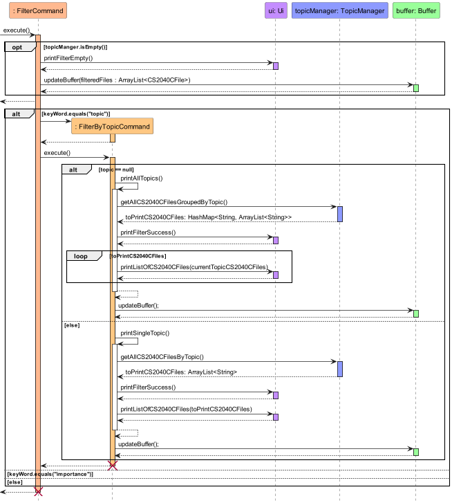

> **! Note**: The lifeline for `FilterCommand` and `FilterByTopicCommand` should end at the destroy marker (X) but due 
> to limitation of PlantUML, the lifeline reaches the end of the diagram.

<p align="right">(<a href="#top">back to top</a>)</p>
<div id="implementation-toposort"></div>

### TopoSort feature
#### Current implementation

The TopoSort mechanism is facilitated by `TopoCommand`. It extends `Command` with an 
overridden `execute()` method, and stores internally the name of the note file and 
topologically sorted notes as `name` and `topoSortedCS2040CFiles`.
Additionally, it implements the following operations:

- TopoCommand#printTopoSortedCS2040CFiles() - Prints all CS2040CFiles after a specific 
target CS2040CFile in a topological manner. 
- TopoCommand#printSingleTopic() - Prints all CS2040CFiles of a single specific topic.

These operations are `private` and can only be accessed in `TopoCommand`.

Given below is an example usage scenario and how the TopoSort mechanism behaves at each step.

> **Step 1:** The user will input a command in the format `topo n\noteName`. The input will be read
> by the `Ui` and processed by the `Parser`. The `Parser` will then call the `prepareTopoCommand`
> to create a new `TopoCommand` object.

> **Step 2:** The `execute` method of the `TopoCommand` object will be executed, which will check
> whether there are any saved notes (via the `isEmpty` method of `TopicManager`) and whether the `noteName` exists as a 
> note in the application
> (via the `isRepeatedCS2040CFile` method of `TopicManager`).

> **Step 3:** The `printTopoSortedCS2040CFiles` method is called to obtain the relevant note files in topological
> order from `TopicManager` via the `getAllCS2040CFilesBeforeTopic` method. This will be stored internally in 
> a LinkedHashMap called `topoSortedCS2040CFiles`.

> **Step 4:** For all topics present in `topoSortedCS2040CFiles`, `printSingleTopic` will be executed to print all
> note names present in the specific topic. As the topics are saved in topological order, the printed note names
> will be printed in the correct order.

The following sequence diagram shows how the `TopoCommand` works.

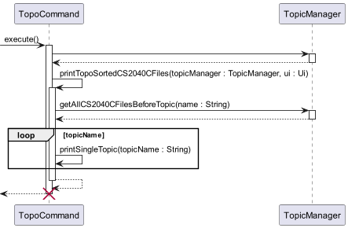

> **! Note**: The lifeline for `TopoCommand` should end at the destroy marker (X) but due to limitation of PlantUML,
> the lifeline reaches the end of the diagram.

<p align="right">(<a href="#top">back to top</a>)</p>
<div id="implementation-export"></div>

### Export feature
#### Current implementation

The export function is supported by a singleton object, `Buffer`.
Whenever a `filter` or `topo` command is called, the method
within the `Buffer` object, `updateBuffer` would be called which
replaces the `CS2040CFile` objects stored within the buffer with the
output `CS2040CFile` objects being output from the `filter`
command.

When an `export` command is then called, a `ExportCommand`
object is instantiated. The `ExportCommand` object extends
`Command` with an overridden `execute()` method. When the
`execute()` method is called, the `exportBuffer` method in the
`Buffer` is called. This copies all the `CS2040CFile` stored in
the buffer to the export folder stored at `.\\export` and opens
the folder by using the default file explorer of the system.
> Take note that this does not work for some Operating Systems
> without a file explorer (e.g. some Linux-based systems)

The following sequence diagram shows how the export feature works.


> **! Note**: The lifeline for `ExportCommand` and `EmptyBufferCommand` should end at the destroy marker (X) but due to 
> limitation of PlantUML, the lifeline reaches the end of the diagram.

<p align="right">(<a href="#top">back to top</a>)</p>
<div id="product-scope"></div>

## Product scope
### Target user profile

- CS2040C students (but inclusive of other groups e.g. tutors)
- has a need to keep track of a significant number of notes
- prefers desktop CLI over other available note manager application(s)
- prefers typing to mouse interactions

### Value proposition

Manage notes faster and more efficiently than a typical mouse/GUI driven application

<p align="right">(<a href="#top">back to top</a>)</p>
<div id="user-stories"></div>

## User Stories

| Version | As a(n) ...                                              | I want to ...                                                               | So that I can ...                                                            |
|---------|----------------------------------------------------------|-----------------------------------------------------------------------------|------------------------------------------------------------------------------|
| v1.0    | user                                                     | be able to add notes                                                        | view them later                                                              |
| v1.0    | user                                                     | be able to delete notes                                                     | replace existing notes with new ones                                         |
| v1.0    | user                                                     | be able to save my notes                                                    | reuse the saved data after closing and reopening the application             |
| v1.0    | user                                                     | list all my notes                                                           | see the amount of content I have to study                                    |
| v1.0    | first time user                                          | to be able to know how to use the application                               | N/A                                                                          |
| v1.0    | tutor teaching CS2040C                                   | organize my notes according to their topic                                  | easily find the relevant content                                             |
| v1.0    | student in CS2040C                                       | be able to study CS2040C according to their topic linkages in Visualgo      | study the prerequisite topics for more advanced topics                       |
| v1.0    | efficiency-obsessed student in CS2040C                   | be able to find relevant topic notes easily                                 | study the relevant topics efficiently                                        |
| v2.0    | organized student in CS2040C                             | be able to sort my notes according to level of importance                   | identify which topics to study first when I am preparing for my exam         |
| v2.0    | As a student in CS2040C                                  | be able to list my notes in topological sort order                          | study the prerequisite topics first before studying the more advanced topics | 
| v2.0    | As a CS2040C student with weekly programming assignments | be able to save my `.cpp` files                                             | refer to them in the future                                                  |
| v2.0    | As a student in CS2040C                                  | be able to extract out relevant files into a folder                         | easily access them during revision                                           |
| v2.0    | As an advanced user of CLIAlgo                           | be able to chain commands such that they will be executed one after another | use CLIAlgo more efficiently                                                 |

<p align="right">(<a href="#top">back to top</a>)</p>
<div id="use-cases"></div>

## Use Cases

(For all use cases below, the **System** refers to the `CLIAlgo` Notes Manager and the **Actor** is the `user` unless specified otherwise)

**Use case: Delete a note**

**MSS**
1. User requests to list notes
2. CLIAlgo shows the list of notes saved
3. User requests to delete a specific note (based off the notes on the list)
4. CLIAlgo deletes the note

Use case ends.

**Extensions**
- 2a. The list is empty
1. CLIAlgo prints an error message and prompts user to view the `help` command.

Use case ends.

- 3a. The user-input note name is invalid (does not exist)
1. CLIAlgo prints an error message and prompts user to view the `help` command.

Use case ends.

<p align="right">(<a href="#top">back to top</a>)</p>
<div id="non-functional-requirements"></div>

## Non-Functional Requirements

1. Should work on any mainstream OS as long as it has Java `11` or above installed.
2. Should be able to hold up to 1000 notes without a noticeable sluggishness in performance for typical usage.
3. A user with above average typing speed for regular English text (i.e. not code, not system admin commands) should be able to accomplish most of the tasks faster using commands than using the mouse.
4. Should be able to handle situations where data files are corrupted (i.e. missing or altered fields)
5. Should be easily reusable for other developers who wish to create a similar app.
6. Should be easily maintainable and modifiable, by having private attributes and methods which reduces dependencies between different parts of the program
7. Should be secure in terms of protecting sensitive data such as name and path of files and preventing unauthorised access to them.
8. Should be able to execute user commands in no longer than 2 seconds.

<p align="right">(<a href="#top">back to top</a>)</p>
<div id="glossary"></div>

## Glossary

* *notes* - A note file saved by the user as a `.txt` or `.cpp`
* *desktop CLI* - The terminal in Windows, Linux or macOS
* *mainstream OS* - Windows, Linux or macOS
* *CS2040C* - The Data Structures and Algorithms module in NUS
* *Visualgo* - A webpage developed by Professor Steven Halim for use in modules such as CS2040C
* *topics* - One of the ten topics taught in CS2040C

<p align="right">(<a href="#top">back to top</a>)</p>
<div id="instructions"></div>

## Instructions for manual testing

Below are guidelines for testers to test the application

<div id="instructions-initialisation"></div>

### Initialisation
1. Download the jar file and copy into an empty folder
2. Right click in the folder where the jar file is located and open the 
command-line interface. 
_**Example:**_ `` Open in Terminal``
3. Type: ``java -jar .\NAME_OF_JAR_FILE`` where ``NAME_OF_JAR_FILE``
is the file name of the jar file.
4. The application would then open in the command-line interface.
5. Note that if the application has initialised correctly, there would be a 
`data` folder created with some `.txt` files in the same directory as the 
jar file. There also would be an `export` folder
created.

#### _Optional : Test Mode_
1. If the tester does not want their data that they entered to be saved, they 
can type the command: `start-test-mode` to start a debugging mode 
after opening the application.
    1. If done correctly this is what the tester will see:
    ```
    ======================================================
     Starting test mode.
    ======================================================
    ```
   2. There would be a `testdata` folder created with some `.txt` files
   in the same directory as the jar file.
   3. All the below testing will then reflect in the `.txt` files in 
   the `testdata` folder.
      1. If manually editing the data file, it has to be done in the data 
      files within `testdata`.
2. To exit test mode, type the command `exit-test-mode`.
   1. If done correctly this is what the tester will see:
    ```
   ======================================================
    Ending test mode.
   ======================================================
   ======================================================
    Successfully deleted file.
   ======================================================
   ======================================================
    ```
3. The `testdata` folder should now be deleted.   

> **WARNING**
> 
> The user _has_ to exit test mode or the test mode data would not be 
> wiped correctly.

<p align="right">(<a href="#top">back to top</a>)</p>
<div id="instructions-shutdown"></div>

### Shutdown
1. After all the testing is done, type in the command: `exit`.
   1. If done correctly this is what the tester will see:
    ```
   ======================================================
   Thank you for using CLIAlgo! Study hard!
   ======================================================
    ```
   2. The application would then close in the command-line interface.

<p align="right">(<a href="#top">back to top</a>)</p>
<div id="instructions-add"></div>

### Adding a `Note`
1. Type the command: `add n/NOTE_NAME t/TOPIC_NAME` or `add n/CODE_NAME t/TOPIC_NAME`.
   1. `NOTE_NAME` would represent the name of the note.
      1. The note file is in the form `NOTE_NAME.txt`.
      2. The note file has to exist in the same directory as the
      `.jar` file of this application else it'll print an error 
      message.
   2. `CODE_NAME` would represent the name of the code file.
      1. The code file is in the form `CODE_NAME.cpp`.
      2. The code file has to exist in the same directory as the
      `.jar` file of this application else it'll print an error
      message.
   3. `TOPIC_NAME` would represent the `Topic` the note is tagged to.
      1. **CASE 1 :** The `TOPIC_NAME` is valid.
      > Example : 
      > 
      > add n/name t/LINKED_LIST
      2. **CASE 2 :** The `TOPIC_NAME` is invalid.
      > Example :
      >
      > add n/name t/linkedlist
      > 
      > add n/name t/SOMETHING
2. Leaving any fields blank would cause an error message to be printed.
> Example :
>
> add n/ t/
> 
> add n/name t/
3. Leaving out `n/` or `t/` would cause an error message to be printed.
> Example :
>
> add name LINKED_LIST
=======
> add note LINKED_LIST
4. Optional to add an importance tag to the CS2040CFile, which is a number from 1 to 10
> Example : 
> 
> add n/name t/LINKED_LIST i/5
>5. Adding an importance number no within the range of 1 to 10 would cause and error message to be printed.
> Example:
>
> add n/name t/LINKED_LIST i/100

<p align="right">(<a href="#top">back to top</a>)</p>
<div id="instructions-list"></div>

### Listing all `Files`
1. Type the command: `list`.
   1. **CASE 1 :** There are some `Files` stored.
      1. The application would print out all the `Files` stored.
      2. Note that `Files` include both `Notes` and `Codes`.
   2. **CASE 2 :** There are no `Files` stored.
      1. The application would print out a message indicating that no 
      notes have been stored.

<p align="right">(<a href="#top">back to top</a>)</p>
<div id="instructions-delete"></div>

### Deleting a `File`
1. Type the command: `remove n/FILE_NAME`.
   1. `NAME` would represent the name of the note or code 
   stored.
   2. **CASE 1 :** The `Note` or `Code` with `FILE_NAME` exists.
      1. The `Note` or `Code` is deleted successfully and a message would be printed.
   3. **CASE 2 :** The `Note` or `Code` with `FILE_NAME` 
   does not exist.
      1. The application would print out an error message indicating 
      that the note does not exist.
2. Leaving any fields blank would cause an error message to be printed. 
> Example :
>
> remove n/
3. Leaving out `n/` or `t/` would cause an error message to be printed.
> Example :
>
> remove name

<p align="right">(<a href="#top">back to top</a>)</p>
<div id="instructions-filter"></div>

### Filtering `Files`
1. Type the command: `filter k/KEYWORD [t/TOPIC_NAME]`.
   1. `KEYWORD` would be `topic` representing filtering by 
   `Topic` or `importance` representing filtering by the 
   importance attribute tagged to each `Note` or `Code`
   added into the application.
   2. `TOPIC_NAME` would represent the `Topic` the note is 
   tagged to or `Importance` level.
   3. `TOPIC_NAME` is an optional field
      1. **CASE 1 :** The `TOPIC_NAME` is valid.
      > Example :
      >
      > filter k/topic t/LINKED_LIST
      2. **CASE 2 :** The `TOPIC_NAME` is invalid.
      > Example :
      >
      > filter k/topic t/linkedlist
      >
      > filter k/topic t/SOMETHING
2. Leaving `k/` blank would cause an error message to be printed.
> Example :
>
> filter k/
3. Leaving out `t/` is valid
> Example :
>
> filter k/topic

<p align="right">(<a href="#top">back to top</a>)</p>
<div id="instructions-export"></div>

### Exporting `Files`
1. After a command for `filter` or `topo`, the `Files` that were listed would be stored in the `Buffer`.
2. These `Files` would be copied to the `export` folder and given that it is supported by the Operating
System, the `export` folder would automatically be opened.
   1. If opening the folder is not supported, an invalid command error would be printed, but the `Files`
   would still be copied into the `export` folder.
3. The contents of the `Files` copied would be identical to the `File` in the directory where the `.jar`
file is located.
4. If `filter` or `topo` is called again, the `export` folder would not be updated until `export` is inputted
again.

<p align="right">(<a href="#top">back to top</a>)</p>
<div id="instructions-save"></div>

### Saving data
1. `Notes` and `Codes` are represented as : 
`NAME&@PATH_TO_FILE&@TOPIC_NAME&@IMPORTANCE`
2. The application checks for invalid `TOPIC_NAME` only
3. The application checks that there are at least three fields separated by `&@`
4. Corrupted lines of files are ignored by the application and removed 
subsequently
> Example:
> 
> Initial .txt file:
> 
> TEST1&@test1.txt&@wrr
> 
> TEST2&@test2.txt&@SORTING
> 
> After running application:
> 
> TEST2&@test2.txt&@SORTING

> Example:
>
> Initial .txt file:
>
> TEST1&@
>
> TEST2test2.txtSORTING
>
> After running application:
5. If a data file is deleted in the middle of the application running somehow the 
application would recreate the file in its last state when running `add` or 
`remove` 
6. If a file stored in the data file does not exist in the directory,
it is considered to be a corrupted entry.

<p align="right">(<a href="#top">back to top</a>)</p>
